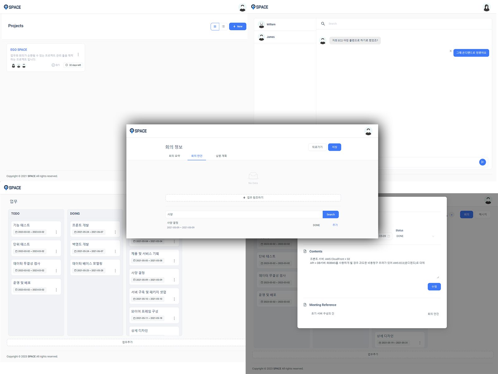

### EGO SPACE: 프로젝트 관리 서비스

[프로젝트 회고록](https://jisulog.com/docs/essay/project-review/2021-ego-space)

## 개요
EGO SPACE는 팀 프로젝트를 원활하게 진행하고자 하는 모든 이들을 위한 도구입니다. 
팀원들과의 메시지를 통해 아이디어를 공유하고, TDD 칸반보드로 직관적으로 업무 진행상황을 확인해보세요. 
회의가 필요한 업무를 바로 다음 회의에 참조해두고, 회의를 통한 결과를 바로 실행 계획의 업무로 생성합니다.
빠르게 바뀌는 업무 환경에서도 항상 최상의 상태로 프로젝트를 진행할 수 있습니다.

## 설치 및 실행 방법
> [demo](https://space.ego.so/)  

## 주요 기능
- 팀 기반 프로젝트를 생성한다.
- 프로젝트의 팀원과 메시지를 주고 받는다.
- TDD 칸반보드를 활용해 업무 진행 상황을 관리한다.
- 업무를 회의 안건과 실행 계획으로 참조한다.
- 링크를 통해 참조된 업무나 회의로 연결된다.

## 기술 스택
- **언어**
    - Java
    - Javascript
    - HTML/CSS
- **서버**
    - Tomcat
- **프레임워크**
    - Spring Boot
    - React
- **API, Library**
    - JPA 
    - Lombok 
    - Jasypt
- **데이터베이스**
    - MySql
- **IDE**
    - IntelliJ

## 라이선스
Copyright © 2021. [JISU YANG](https://jisulog.com/). All rights reserved.